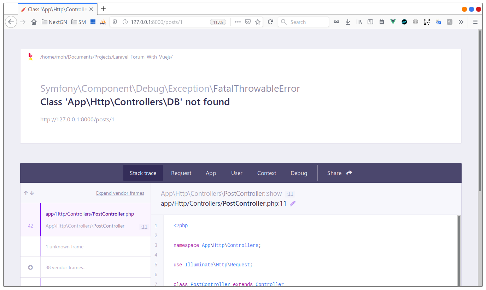
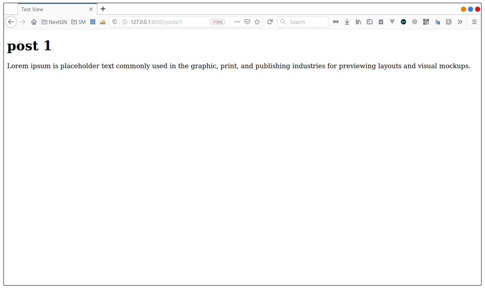

# Eloquent

## Importing classes
Last time we used the class `DB` but we added a `\` before it because there is somthing called namespace

```php
namespace App\Http\Controllers;
```

at the top of the controller and if we remove the `\` when using DB we will have this problem



Because laravel is looking for the class db in the `App\Http\Controllers` namespace, but the class `DB` belongs the 
the root namespace and to make things work again we need to import it like this

```php
<?php

namespace App\Http\Controllers;

use DB;
use Illuminate\Http\Request;

class PostController extends Controller
{
//....

```
and now everythings work like befor



## Eloquent Model 

so the `DB` class gives us a clean API to make database queries, but there is an even more clean way to do this, by using
the eloquent Model, type `php artisan` command in the terminal and look for the make section you will find

```text
  .....
 make
  make:channel                        Create a new channel class
  make:command                        Create a new Artisan command
  make:controller                     Create a new controller class
  make:event                          Create a new event class
  make:exception                      Create a new custom exception class
  make:factory                        Create a new model factory
  make:job                            Create a new job class
  make:listener                       Create a new event listener class
  make:mail                           Create a new email class
  make:middleware                     Create a new middleware class
  make:migration                      Create a new migration file
  make:model                          Create a new Eloquent model class
  make:notification                   Create a new notification class
  make:observer                       Create a new observer class
  make:policy                         Create a new policy class
  make:provider                       Create a new service provider class
  make:request                        Create a new form request class
  .....
```
we have `make:model` and in the descrioption we use it to **Create a new Eloquent model class**, so we are working with
posts and with that in mind let's create a Model class called **Post**

```bash
php artisan make:model Post
```
*output*
```text
Model created successfully.
```

this create a class for us we can find it in the **app** folder the file name is `Post.php`

*app/Post.php*
```php
<?php

namespace App;

use Illuminate\Database\Eloquent\Model;

class Post extends Model
{
    //
}

```


so why do need a Model, well the Eloquent model is useful it tow ways
- it provides the same API to perform SQL queries
- it's where we store relevant business logic

To use the Model we need to first import it and if you notice it's in the `App` namespace
so we add
```php
use App\Post;
```

and in the show function we replace the `DB` statament with 

```php
//$post = DB::table('posts')->where('id' ,'=',$id)->first();
$post = Post::find($id);
```

and if we refresh it works the same way, it's just the code is cleaner


 
and we can even cleen it more buy using `findOrFail()` function in stead like this

```php
$post = Post::findOrFail($id);

/*if(!$post) {
    abort(404, 'that post was not found');
}*/
```
no we don't have to check if the `$post` is `null`

and even more we can make the variable `$post` inline like this

```php
<?php

namespace App\Http\Controllers;

use App\Post;
use Illuminate\Http\Request;

class PostController extends Controller
{
    public function show($id){
        return view('test',[
            'post' => Post::findOrFail($id)
        ]);
    }
}
```
isn't this just better?

### RECAP
- we have seen how to import classes from other namespaces
- we know now how to create a model class using **artisan**
- we know how to use model to fetch data or fail
