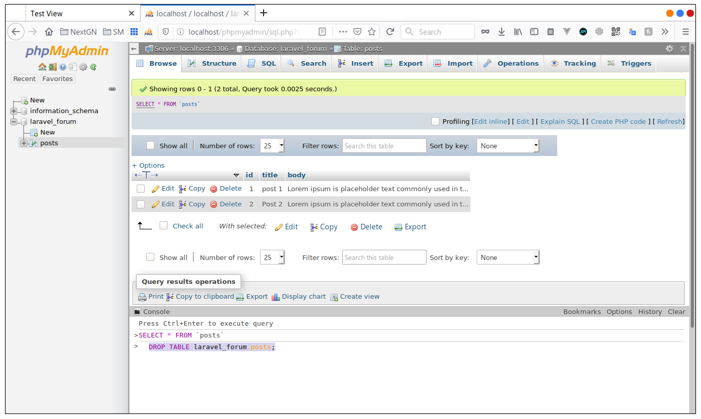
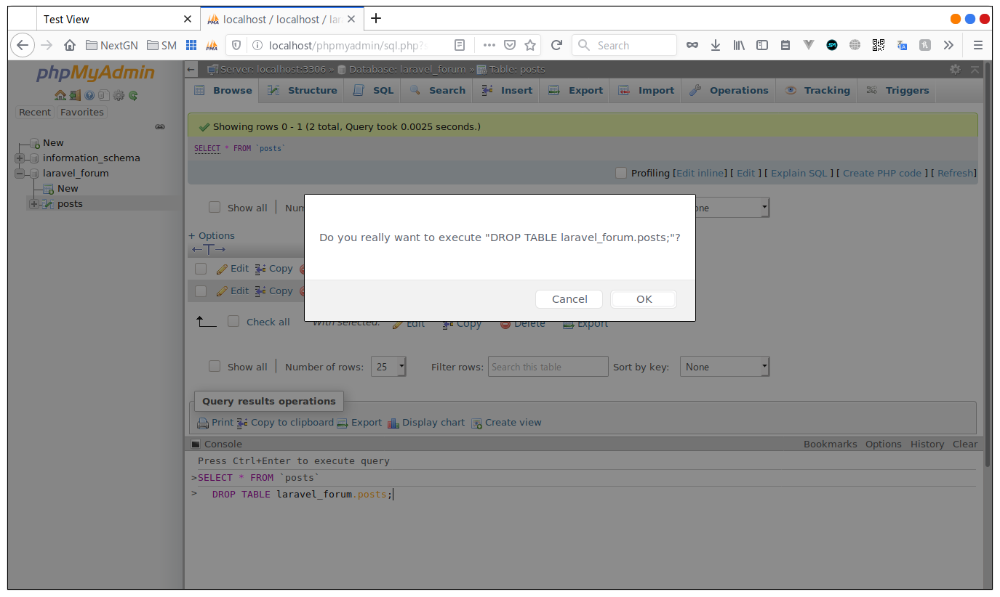
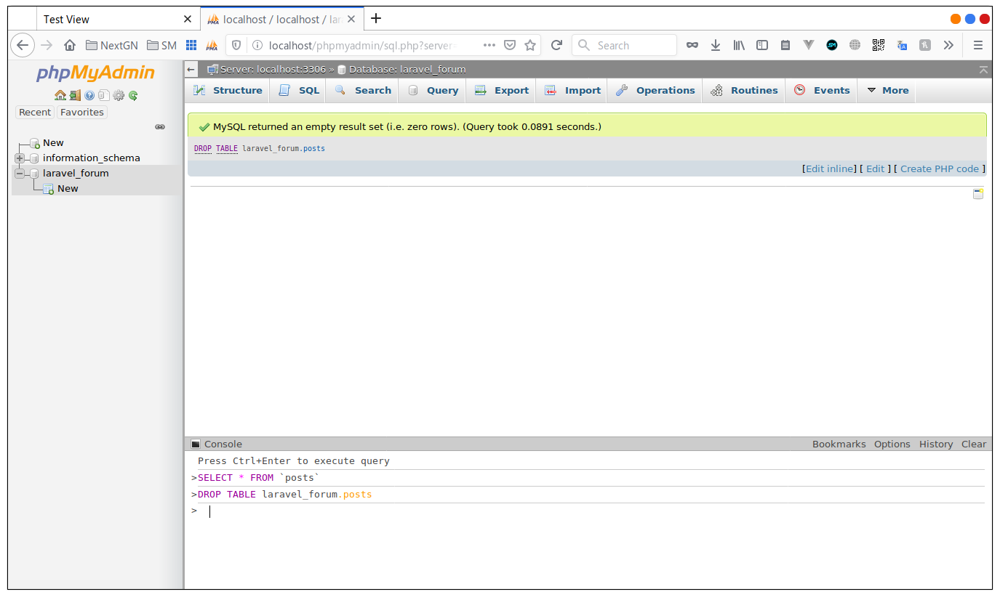
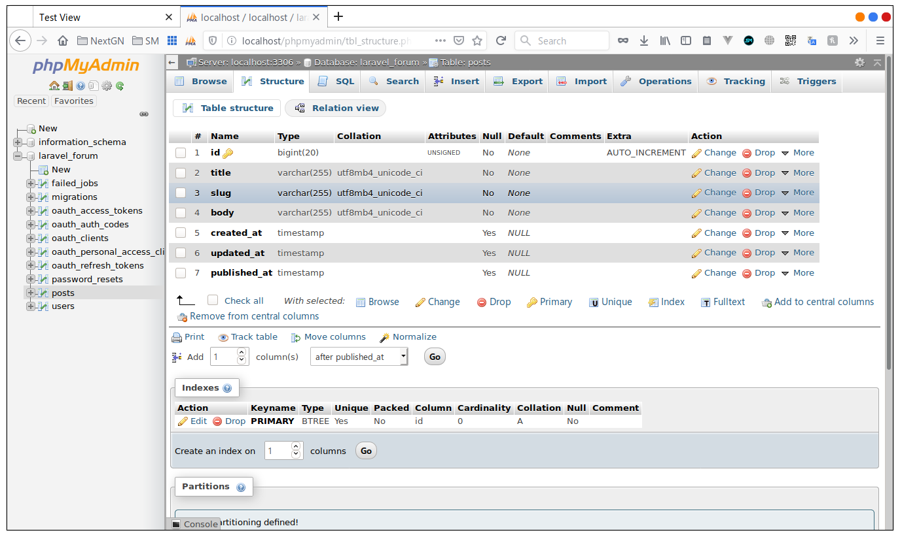
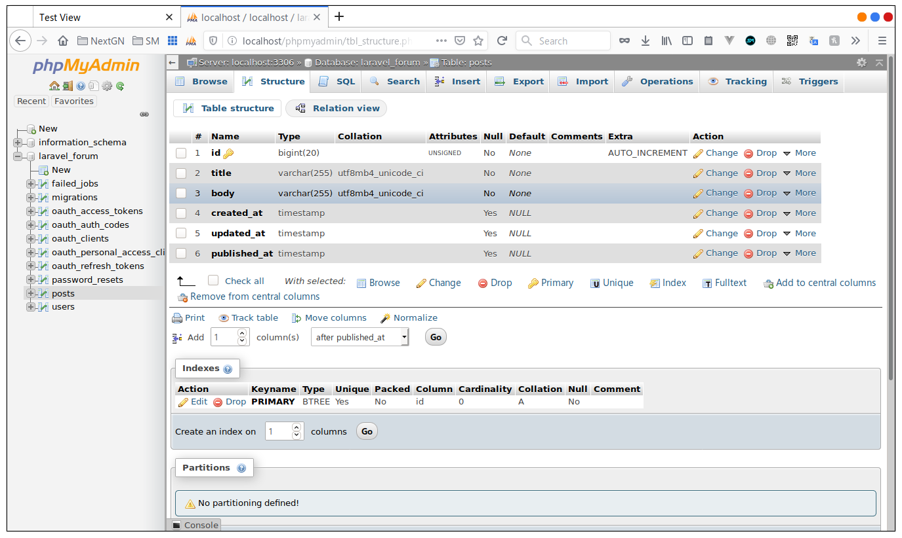

# Migrations

We have created a posts table in the database manually, but we don't use that in laravel, there is a better way to 
create tables and edit theme and add or remove columns, and that's called migrations,

let's start buy dropping the table we added last time, in **phpMyAdmin** there is a console tab at the bottom of the
window, you can type sql queries there, to remove the table type 

```sql
DROP TABLE laravel_forum.posts;
```

 

and hit **CTRL  + ENTER** to execute the command, and confirm



like this we have removed the table from the database

 

## creating migraations
when creating migration it's nice to give a human readable name, in our example we want to create a posts table
so we use `make:migration` and we give the name **create_posts_table**

```bash
php artisan make:migration create_posts_table
```

*output*
```text
Created Migration: 2019_11_29_144942_create_posts_table
```

and like this we create a migration class we can find it in the **database/migrations** directory

```php
<?php

use Illuminate\Database\Migrations\Migration;
use Illuminate\Database\Schema\Blueprint;
use Illuminate\Support\Facades\Schema;

class CreatePostsTable extends Migration
{
    /**
     * Run the migrations.
     *
     * @return void
     */
    public function up()
    {
        Schema::create('posts', function (Blueprint $table) {
            $table->bigIncrements('id');
            $table->timestamps();
        });
    }

    /**
     * Reverse the migrations.
     *
     * @return void
     */
    public function down()
    {
        Schema::dropIfExists('posts');
    }
}
```

> notice that laravel has already other migration like users and password reset but let's just leave theme for later 
and focus on our migration now.

## what's is a migration
you can think about a migration as a version control for our database, it gives us a prgramatic way to deficne the 
structore of our tables, or even make a change to an existing one, what's greate about this is that if in any point
we make a mistake or we need a change all we have to do is roll back the migration and then rerun it or even better
becouse these files are in the version control everyone in the team will have the same database sctructor liek you
just buy runing the migrations

## creating columns
now let's add the columns we need in the `up()` function we see the the `Schema` class is creating a table called
posts with a blueprint $table, that' $table variable have some functions the first one we see is bigIncrements
that takes a string as a parameter this time is 'id', this is like creating a columns name **id** with type bigInteger
and making it primary and not null and auto incremented, in the next line we see `$table->timestamps();` this is going
to create tow columns **created_at** and **updated_at** with type of timestamp,

```php
Schema::create('posts', function (Blueprint $table) {
    $table->bigIncrements('id');
    $table->timestamps();
});
```

to add our columns **title** and **body** we use a `string()` and `text()` functions like this

```php
Schema::create('posts', function (Blueprint $table) {
    $table->bigIncrements('id');
    $table->string('title');
    $table->string('body');
    $table->timestamps();
});
```
sometimes we want to shcadoule a post for a later time so let's add and published_at timestamp columns and let's make it
nullable like this

```php
Schema::create('posts', function (Blueprint $table) {
    $table->bigIncrements('id');
    $table->string('title');
    $table->string('body');
    $table->timestamps();
    $table->timestamp('published_at')->nullable();
});
```

> the nullable means that the columns can be null

## up and down methods

the up methode is where we defind our columns it's been executed when are run the migration,
the down methond is to undo enaything we have don in the up method in this case droping the table 


## runing the migration
no everything should be clear, so let's run the migaration like this, type in the terminal

```bash
php artisan migrate
```

ignore most of the output, those are other migration in laravel and they are to create other tables but, let's jsut 
look at the last tow lines

```text
....
Migrating: 2019_11_29_144942_create_posts_table
Migrated:  2019_11_29_144942_create_posts_table (0.08 seconds)
```
this is telling us that the migration is done, in phpMyAdmin we can see that some new tables have been added to our 
database, and one of them is posts table


and us expected we have our columns

   
 

## adding columns

let's say we what to add slug columns to our table.

there are two ways to add columns
  1. ### adding a new migration
  
like this
  
```bash
php artisan make:migration add_slug_to_posts_table
```

and we will have an new class in migrations folder

```php
<?php

use Illuminate\Database\Migrations\Migration;
use Illuminate\Database\Schema\Blueprint;
use Illuminate\Support\Facades\Schema;

class AddSlugToPostsTable extends Migration
{
    /**
     * Run the migrations.
     *
     * @return void
     */
    public function up()
    {
        Schema::table('posts', function (Blueprint $table) {
            //
        });
    }

    /**
     * Reverse the migrations.
     *
     * @return void
     */
    public function down()
    {
        Schema::table('posts', function (Blueprint $table) {
            //
        });
    }
}
```

notice the `Schema` class is using a table function this time instead of create because we are trying  to edit the table
not create a new one

in the up function we can add our columns like this

```php
Schema::table('posts', function (Blueprint $table) {
    $table->string('slug')->after('title');
});
```

and in the down function we undo the adding, we drop the column like this

```php
Schema::table('posts', function (Blueprint $table) {
    $table->dropColumn('slug');
});
```

we run it the same way

```
php artisan migrate
```
and this time we have just our migration output, because the other migration have been ran before

*output*
```text
Migrating: 2019_11_29_152927_add_slug_to_posts_table
Migrated:  2019_11_29_152927_add_slug_to_posts_table (0.11 seconds)
```

and columns has been added 



and here is the **RULE** you should only do this if you have pushed the code to production, if not you should use the 
second method, and because we are only in development let's rollback the migration using

```bash
php artisan migrate:rollback
```
*output*
```text
Rolling back: 2019_11_29_152927_add_slug_to_posts_table
Rolled back:  2019_11_29_152927_add_slug_to_posts_table (0.12 seconds)
```
and if we refresh we see the the columns has gone



and let's delete the migration from the **database/migration** folder 

```bash
rm database/migrations/2019_11_29_152927_add_slug_to_posts_table.php 
```
> this wont work for you because the timestamp in the file name is different, use your file name or delete the file from
the editor or file explorer

2. ### adding comulns in the orginal migration
yes we need to just add the table in our roginal migration

```php
Schema::create('posts', function (Blueprint $table) {
    $table->bigIncrements('id');
    $table->string('title');
    $table->string('slug');
    $table->string('body');
    $table->timestamps();
    $table->timestamp('published_at')->nullable();
});
```

and we migrate
```bash
php artisan migrate:rollback
```
*output*
```text
Nothing to migrate.
```

exactly you see the problem now, we have already run that file before, so we need to rollback one more time, or
in our case since we don't have yet any data in our database we can do a fresh migration buy running 

```bash
php artisan migrate:fresh
```

this will drop all the tables and run the migrations all again

*output*
```text
Dropped all tables successfully.
Migration table created successfully.
Migrating: 2014_10_12_000000_create_users_table
Migrated:  2014_10_12_000000_create_users_table (0.14 seconds)
Migrating: 2014_10_12_100000_create_password_resets_table
Migrated:  2014_10_12_100000_create_password_resets_table (0.22 seconds)
Migrating: 2016_06_01_000001_create_oauth_auth_codes_table
Migrated:  2016_06_01_000001_create_oauth_auth_codes_table (0.21 seconds)
Migrating: 2016_06_01_000002_create_oauth_access_tokens_table
Migrated:  2016_06_01_000002_create_oauth_access_tokens_table (0.21 seconds)
Migrating: 2016_06_01_000003_create_oauth_refresh_tokens_table
Migrated:  2016_06_01_000003_create_oauth_refresh_tokens_table (0.22 seconds)
Migrating: 2016_06_01_000004_create_oauth_clients_table
Migrated:  2016_06_01_000004_create_oauth_clients_table (0.15 seconds)
Migrating: 2016_06_01_000005_create_oauth_personal_access_clients_table
Migrated:  2016_06_01_000005_create_oauth_personal_access_clients_table (0.11 seconds)
Migrating: 2019_08_19_000000_create_failed_jobs_table
Migrated:  2019_08_19_000000_create_failed_jobs_table (0.07 seconds)
Migrating: 2019_11_29_144942_create_posts_table
Migrated:  2019_11_29_144942_create_posts_table (0.08 seconds)
```
> I have more tables but that's for a later time don't worry about it

### RECAP
- we have seen how to create a migration 
- how to create columns
- how to run a migration
- how to add columns
- how to rollback a migration
- how to migrate fresh
