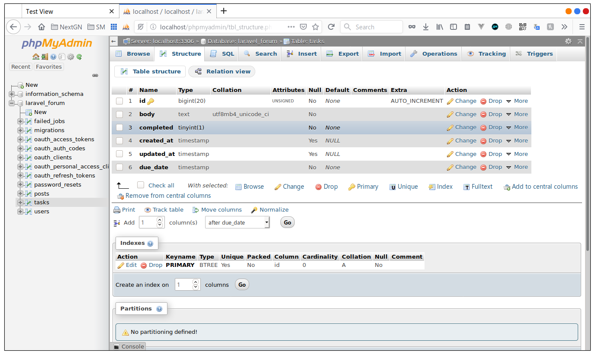
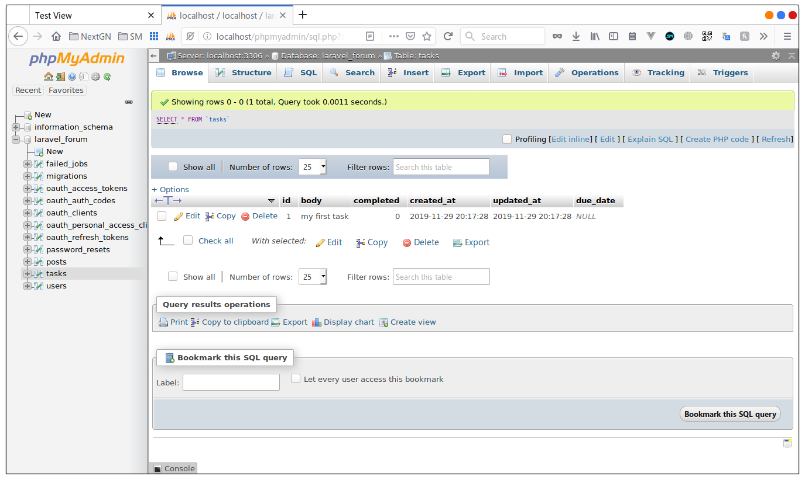
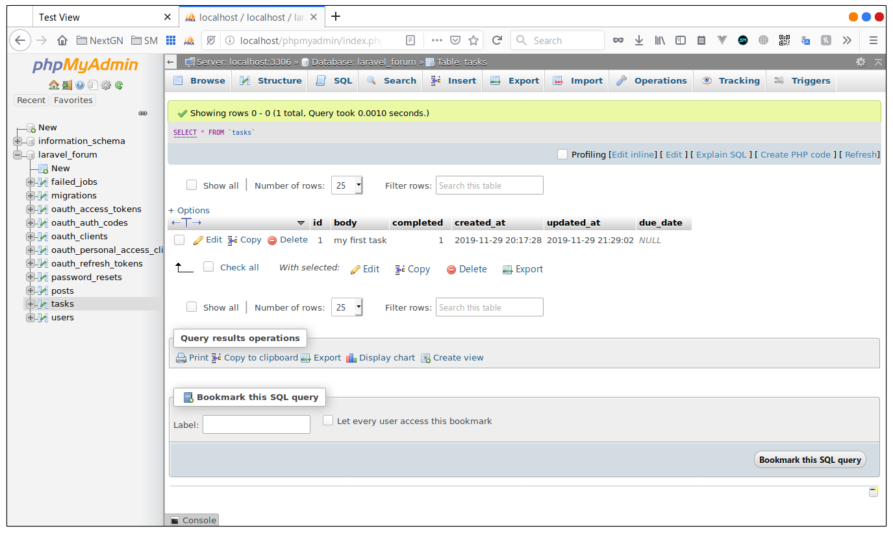

# Business Logic

in the last section we have seen what how to use a Model to query the database, but we haven't talked about logic or
the business logic that we can put in the model, well let's do that now

## preparing a model and migration

let's start buy creating a new Model called Task with it's controller and migration

```bash
php artisan make:model Task -cm
```
*output*
```text
Model created successfully.
Created Migration: 2019_11_29_195411_create_tasks_table
Controller created successfully.
```

now in the migration last's add columns to the tasks table before we migrate, a body text, a completed boolean(true or false)
and a due date with the type of timestamp

```php
Schema::create('tasks', function (Blueprint $table) {
    $table->bigIncrements('id');
    $table->text('body');
    $table->boolean('completed');
    $table->timestamps();
    $table->timestamp('due_date');
});
```

and then migrate,

```shell
$ php artisan migrate
Migrating: 2019_11_29_195411_create_tasks_table
Migrated:  2019_11_29_195411_create_tasks_table (0.2 seconds)
```
in phpMyAdmin you should have something like this


 
no before we continue let's think about it, when we create a task is it done by default, it's decently not, so it would
make more seance if the completed columns was default to false. to do that you should rollback and change the table to:

```php
Schema::create('tasks', function (Blueprint $table) {
    $table->bigIncrements('id');
    $table->text('body');
    $table->boolean('completed')->default(0);
    $table->timestamps();
    $table->timestamp('due_date')->nullable();
});
```

I have also made the due date nullable.

```shell
$ php artisan migrate:rol
Rolling back: 2019_11_29_195411_create_tasks_table
Rolled back:  2019_11_29_195411_create_tasks_table (0.08 seconds)

$ php artisan migrate
Migrating: 2019_11_29_195411_create_tasks_table
Migrated:  2019_11_29_195411_create_tasks_table (0.1 seconds)
```

> note you can write just rol instead of rollback and artisan will know that you mean rollback because no other command
start with migrate:rol, it's a handy shortcut to no write the hole commands every time

## Tinker

laravel Tinker is a php console that gives us access to laravel framework from the terminal, let's just see it, that's 
better then talking about it, type in the terminal:

```bash
php artisan tinker
```

you should have this shell

```shell
Psy Shell v0.9.9 (PHP 7.3.11-0ubuntu0.19.10.1 — cli) by Justin Hileman
>>> 4 + 4
=> 8
>>> 
```

typing 4 + 4 will just calculate the result and print it to the console, the same way with the other php commands.

so to create a new task we would type 
```php
use App\Task;
$task = new Task();
```

or

```php
$task = new App\Task();
```

and it's the same, so choose any one and then type it in the console

```tinker
>>> $task = new App\Task()
=> App\Task {#3126}
>>> 
```

now let's fill the body with some text

```tinker
>>> $task->body = 'my first task'
=> "my first task"
>>>
```

then let's save it

```tinker
>>> $task->save()
=> true
>>>
```
and like this the dask is saved to the database

 

notice that the id is automatically generated, with the created_at and updated_at, the due_date is null, and completed
is default to 0.

and if i type just `$task` in the **Tinker**  console i get that information

```tinker
>>> $task
=> App\Task {#3126
     body: "my first task",
     updated_at: "2019-11-29 20:17:28",
     created_at: "2019-11-29 20:17:28",
     id: 1,
   }
>>> 
```

now let's run some commands in the **Tinker**  console, before we continue to the next step

### some Eloquent API functions

to list all the tasks we use the function all() like this

```tinker
>>> App\Task::all()
=> Illuminate\Database\Eloquent\Collection {#3138
     all: [
       App\Task {#3139
         id: 1,
         body: "my first task",
         completed: 0,
         created_at: "2019-11-29 20:17:28",
         updated_at: "2019-11-29 20:17:28",
         due_date: null,
       },
     ],
   }
>>> 
```

to get the first or the last task we use

```tinker
>>> $task = App\Task::first()
=> App\Task {#3144
     id: 1,
     body: "my first task",
     completed: 0,
     created_at: "2019-11-29 20:17:28",
     updated_at: "2019-11-29 20:17:28",
     due_date: null,
   }
>>> 
```


we can also use the where to find more specific records

```tinker
>>> $tasks = App\Task::where('completed', false)->get()
=> Illuminate\Database\Eloquent\Collection {#3148
     all: [
       App\Task {#3140
         id: 1,
         body: "my first task",
         completed: 0,
         created_at: "2019-11-29 20:17:28",
         updated_at: "2019-11-29 20:17:28",
         due_date: null,
       },
     ],
   }
>>> $tasks = App\Task::where('completed', true)->get()
=> Illuminate\Database\Eloquent\Collection {#3125
     all: [],
   }
>>> 
```

> let's stop here and we will come back later a lot to **Tinker** and we will see more Eloquent API functions

## Adding Logic to Model

Now let's think about what would happen when a use complete a task, he would want to mark the task as complete, 
this what we call a business logic we could add a function to the Model called `markAsComplete` or shorter
`completed` and inside this function we change the status of the task to completed and save it, like this

```php
class Task extends Model
{
    public function complete(){
        $this->completed = true;
        $this->save();
    }
}
```


no the Tinker console doesn't know about the modification we added to the Task Model, se hit `CTRL+C` to quite and 
then 

```bash
php artisan tinker
```

to open tinker console again

and then grep the first taks or the task with the id of 1

```tinker
$ php artisan tinker
Psy Shell v0.9.9 (PHP 7.3.11-0ubuntu0.19.10.1 — cli) by Justin Hileman
>>> $task = App\Task::find(1);
=> App\Task {#3134
     id: 1,
     body: "my first task",
     completed: 0,
     created_at: "2019-11-29 20:17:28",
     updated_at: "2019-11-29 20:17:28",
     due_date: null,
   }
>>> $task->complete()
=> null
>>> 
```

and if we check the database we will find that the task is completed

 

That's how we add business logic to a Model, and you my want say that you can change the completed stat and save direclty
but don't think about it like this think about it more like you are in real project where the busnicess can be more then
2 lines more like 10 or 20 line or even more, would you want to write that every time you need it in your code it would
be a lot of repeated code, this way is just more clean

### RECAP
- we found out about tinker
- we have seen some Eloquent API functions
- we can now make business logic in the Model

