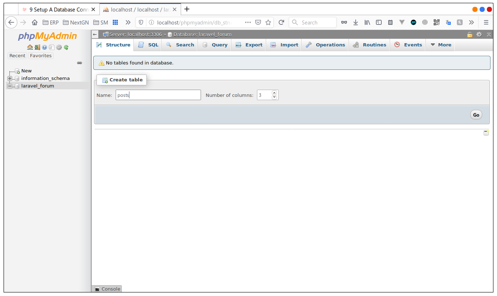
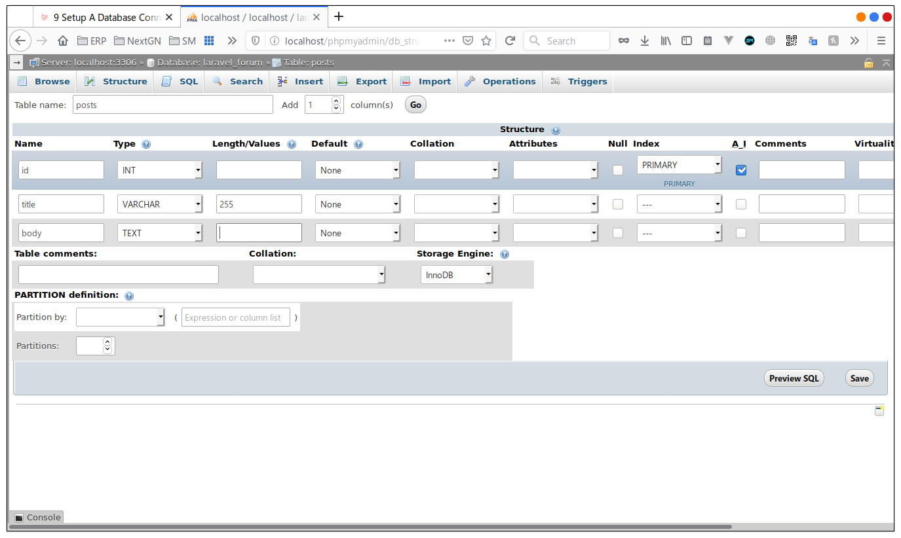
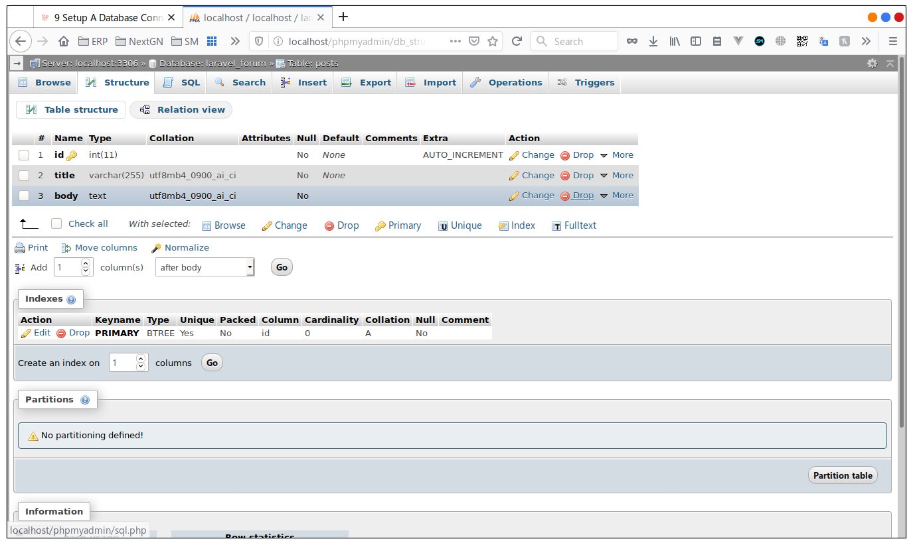
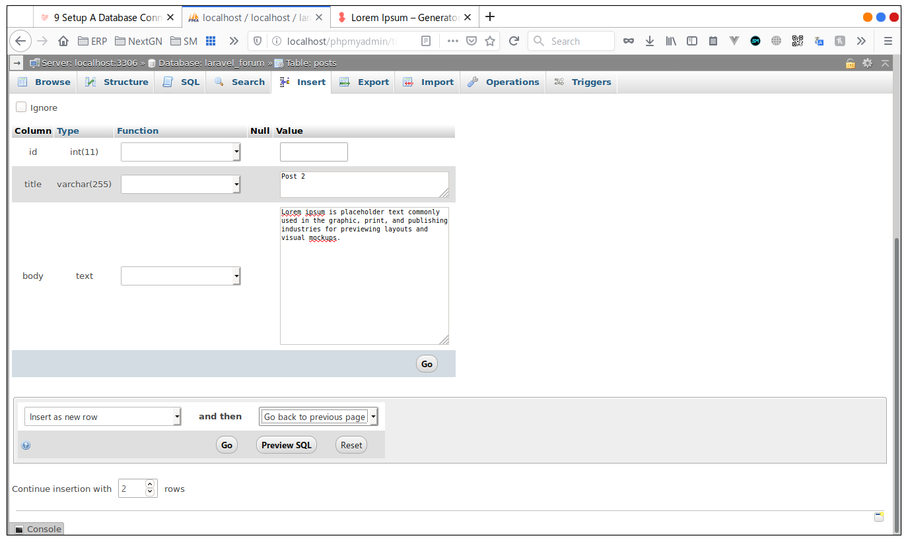
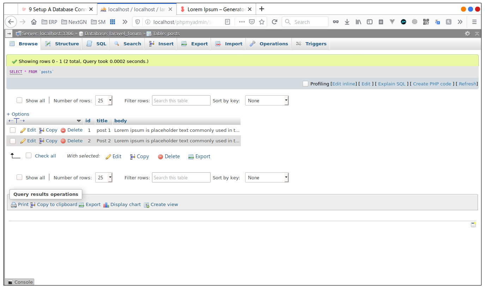
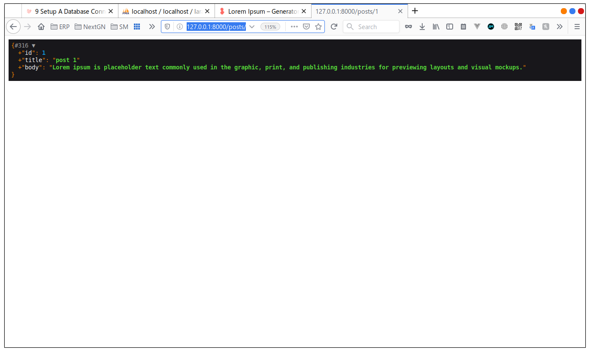
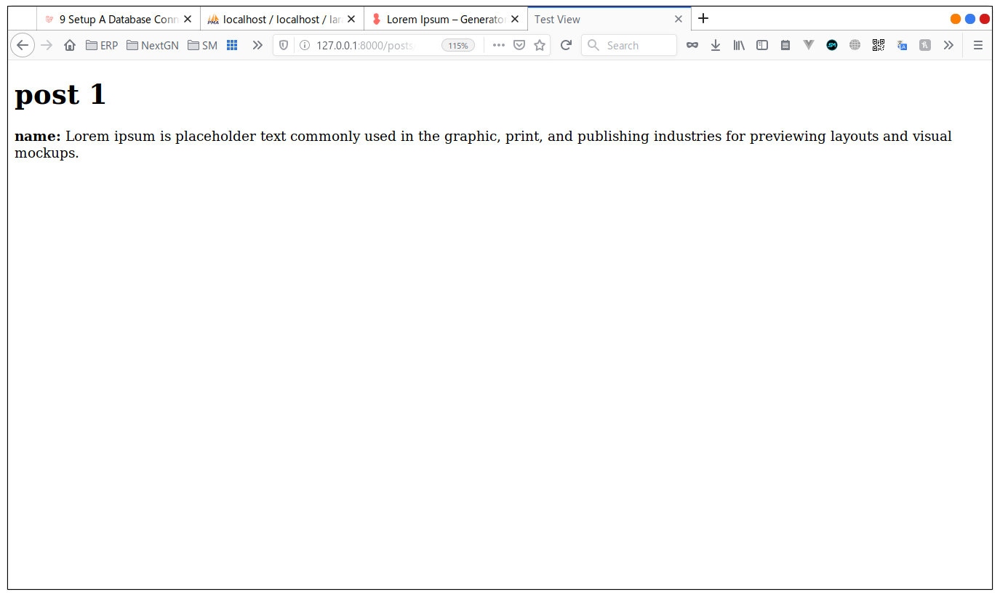
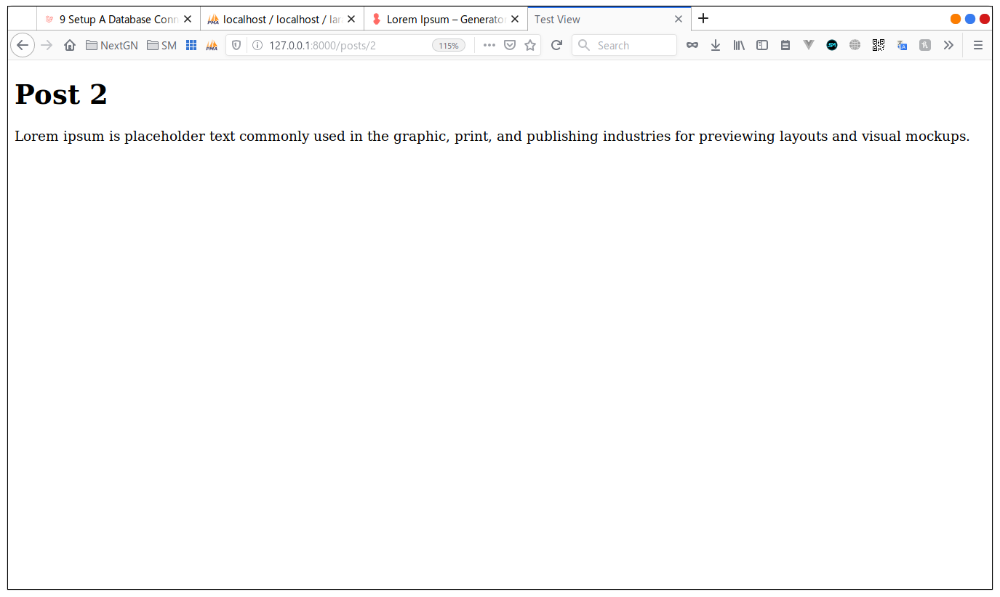
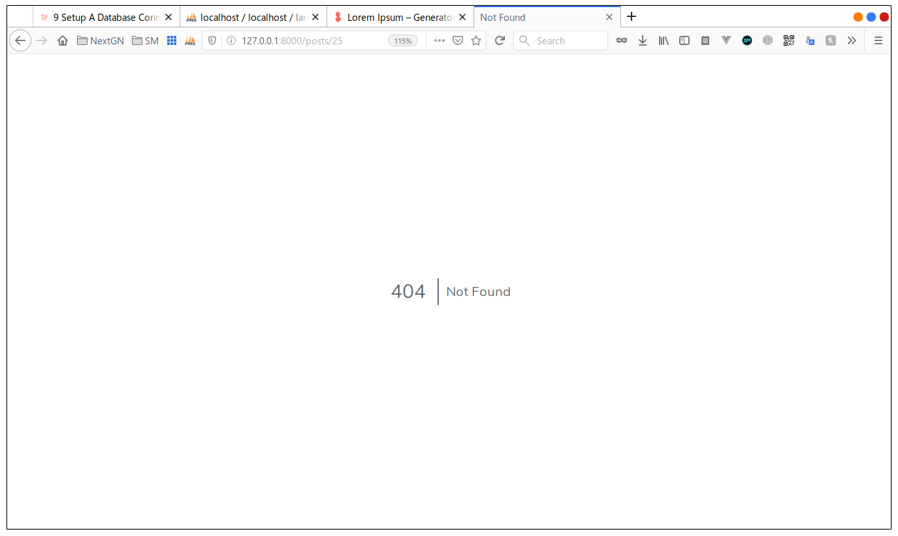

# Setup A Database Connection

Now we have seen in the last section how we used data and returned it vai a controller.
```php
$posts = [
            'post1' => 'This is the post number one',
            'post2' => 'This is the post number Two',
            'post3' => 'This is the post number Three',
        ];
```
but in real life scenarios we use databases, and we query the data from those databases, and that's what we are going to
do in this chapter.

## Setting up the database
abvously we should create a database and link it to laravel but how?

well, Laravel makes it easy to do that separatly from project files, in a file called `.env` in the route directory, if 
you open it now, you should see what we will be calling from now on, the envirement variables, 

```dotenv
APP_NAME=Laravel
APP_ENV=local
APP_KEY=base64:tXArG3Z5qUyTg6Xa06RfdyFJ10g1pk7t4vA1DUvpkzo=
APP_DEBUG=true
APP_URL=http://localhost

LOG_CHANNEL=stack

DB_CONNECTION=mysql
DB_HOST=127.0.0.1
DB_PORT=3306
DB_DATABASE=laravel
DB_USERNAME=root
DB_PASSWORD=

#.....
```

those envirenment variables are refrenced in the configuration files, the files that are in the **config** folder, for 
example if you look at the variables that starts with `DB_`, those are the database realated variables, and if you open 
the `database.php` file in the `config` directory you can see where they are used

*database.php*
```php
//...
/*
    |--------------------------------------------------------------------------
    | Default Database Connection Name
    |--------------------------------------------------------------------------
    |
    | Here you may specify which of the database connections below you wish
    | to use as your default connection for all database work. Of course
    | you may use many connections at once using the Database library.
    |
    */

    'default' => env('DB_CONNECTION', 'mysql'),
    
//....
```

and 

```php
//...
'mysql' => [
            'driver' => 'mysql',
            'url' => env('DATABASE_URL'),
            'host' => env('DB_HOST', '127.0.0.1'),
            'port' => env('DB_PORT', '3306'),
            'database' => env('DB_DATABASE', 'forge'),
            'username' => env('DB_USERNAME', 'forge'),
            'password' => env('DB_PASSWORD', ''),

//....          
```
as you can see they are refrenced in the `env()` function which takes 2 paramaters and key type String and a defult
value, if the key is not in the `.env` file, let's take a look at this

```php
'default' => env('DB_CONNECTION', 'mysql'),
```

this says that we are using the `DB_CONNECTION` from the `.env` file and if it's not set we will use **mysql**
and if we go to the `.env` file and we change this varibale like this

```dotenv
#.....
DB_CONNECTION=sqlite
DB_HOST=127.0.0.1
DB_PORT=3306
#.....
```
 
now we are using **sqlite** instead of **mysql** as a database connection, the same way we set the database name 
`DB_DATABASE` and the database user name and password `DB_USERNAME` & `DB_PASSWORD` and the host is going to be localhost
and the default port we are not going to change those and , if you changed the database connection to **sqlite** change it
back to **mysql**, so let's say we are going to use a database called `laravel_forum` and a user with the name
`laravel_forum_user` and a randomly generated passwrod using an online tool like [LastPass](https://www.lastpass.com/password-generator)
, the password I generated is `TGI8c~mmXgFg`, so the `.env` file will look like this

```dotenv
#.....
DB_CONNECTION=mysql
DB_HOST=127.0.0.1
DB_PORT=3306
DB_DATABASE=laravel_forum
DB_USERNAME=laravel_forum_user
DB_PASSWORD=TGI8c~mmXgFg
#.....
```
 > feel free to change the variables but make sur to use the same values in the next section
 
 ## Creating the database
 
 no we will open the terminal and run these commands
 
 *terminal*
 ```bash
 mysql -u root -p
 ```
 
 then enter the password
 
 *output*
 
```text
Enter password: 
Welcome to the MySQL monitor.  Commands end with ; or \g.
Your MySQL connection id is 8
Server version: 8.0.18-0ubuntu0.19.10.1 (Ubuntu)

Copyright (c) 2000, 2019, Oracle and/or its affiliates. All rights reserved.

Oracle is a registered trademark of Oracle Corporation and/or its
affiliates. Other names may be trademarks of their respective
owners.

Type 'help;' or '\h' for help. Type '\c' to clear the current input statement.

mysql> 

```
 
then to create the database
 
```mysql
CREATE DATABASE laravel_forum;
```
*output*
```text
Query OK, 1 row affected (0.04 sec)
```

then we create the user, and give it grant it access to the previuese database and flush the privligaes

```mysql
CREATE USER 'laravel_forum_user'@'localhost' IDENTIFIED WITH mysql_native_password BY 'TGI8c~mmXgFg';
GRANT ALL ON laravel_forum.* TO 'laravel_forum_user'@'localhost';
FLUSH PRIVILEGES;
```
*output*
```shell
mysql> CREATE USER 'laravel_forum_user'@'localhost' IDENTIFIED BY 'TGI8c~mmXgFg';
Query OK, 0 rows affected (0.05 sec)

mysql> GRANT ALL ON laravel_forum.* TO 'laravel_forum_user'@'localhost';
Query OK, 0 rows affected (0.02 sec)

mysql> FLUSH PRIVILEGES;
Query OK, 0 rows affected (0.00 sec)

mysql>  exit
Bye
```

now this should be it to make the connection

## querying data from the database
so we are going to create a table in our database using the terminal or any GUI applicatoin like **phpMyAdmin** or any 
other way.

so i will be using **phpMyAdmin**
 

and then in the database we created let's create a table called posts with 3 columns, like this



and then fill the columns information 
- id : type of INT,  not null , pramary and autoincirmented
- title : type of VARCHAR(255)
- body: type text

like this



and then save, you should see somthing like this



no into the insert tab to add some data, just fill in the title and the body, the id is auto incremented, and lick Go

  

then got the broaws tab you should see the data we added



## Fetshing the data

no in our controller we will remove the array that we added last time and we will change the parameter to `$id` in the 
show function and we will use a class called `DB` to fetch the data using the id like this

```php
//...
public function show($id){
    
    $post = \DB::table('posts')->where('id' ,'=',$id);
    
    //...
}
//...
```
 
this table function as you can see takes the table name as a parameter and then we use where to fine the post that
it's id equals the $id we enter in the url wildcard

so let's change `web.php` file like this

```php
//...

Route::get('/posts/{id}', 'PostController@show');

```

by doing this we can fetch the post from the database, but we need a way to see it before passing it to the view, and 
to do that we use a function called `dd()`, it's short for day and dump, meaning we pass a $variable to it and it will
stop our applicaion at that point and display the variable to us in the browser, let's try it

add `dd($post)` after the fetsh statement like this

```php
//...
public function show($id){
    
    $post = \DB::table('posts')->where('id' ,'=',$id);
    dd($post);
    //....
}
//...
```
and in the browser enter the URL http://127.0.0.1:8000/posts/1, we see that the variable is nicely formatted, so you see
Laravel already made an Object and id and title and body and filled the values for us so we don't have to do it manually



and now all that's left is pass it to the view 

```php
public function show($id){

    $post = \DB::table('posts')->where('id' ,'=',$id)->first();

    return view('test',[
        'name' => $post
    ]);
}

```

and one last small change in the `test.blade.php` file

```blade

<!doctype html>
<html lang="en">
<head>
    <meta charset="UTF-8">
    <meta name="viewport"
          content="width=device-width, user-scalable=no, initial-scale=1.0, maximum-scale=1.0, minimum-scale=1.0">
    <meta http-equiv="X-UA-Compatible" content="ie=edge">
    <title>Test View</title>
</head>
<body>
    <h1>{{ $post->title }}</h1>
    <p>{{ $post->body }}</p>
</body>
</html>

```

and if we check it should works

 

and buy changing the id of the post in the url,



and one last thing to avoid any errors if the  id doesn't exist in the database we should tech if the $post is not null
before we pass it to the view

```php
public function show($id){

    $post = \DB::table('posts')->where('id' ,'=',$id)->first();

    if(!$post) {
        abort(404, 'that post was not found');
    }

    return view('test',[
        'post' => $post
    ]);
}
```
 in the URL http://127.0.0.1:8000/posts/25 because we don't yet have a post with an id 25, we will get a 404 page
 
 
 
 ### RECAP
 
 - we learn how to connect a database and putting the envirement variables in the `.env` file 
 - we created a database a user and a table, and we instered values in the database table
 - we know now how to fetch data from database by id
 - we have seen the `dd()` function
 - we shown the data from the database in the view
